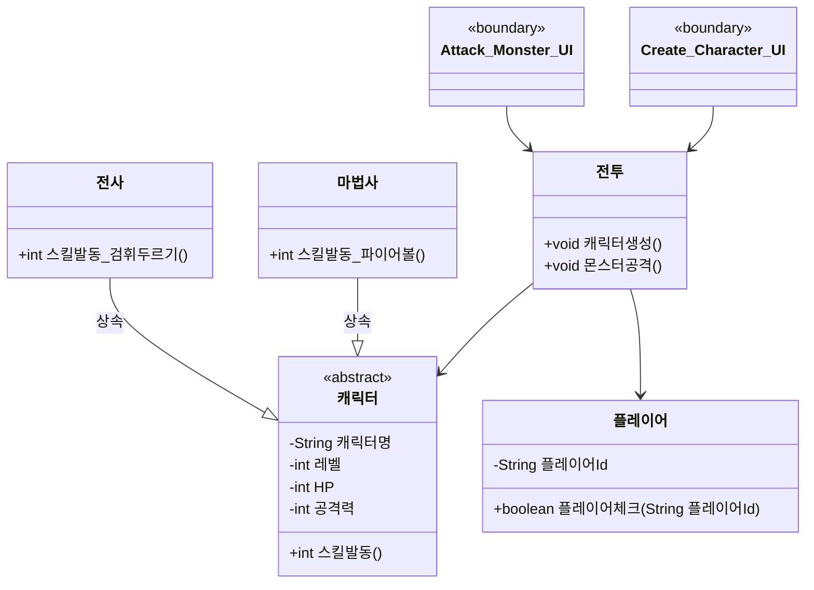

```mermaid
classDiagram

    class 플레이어 {
        -String 플레이어Id
        +boolean 플레이어체크(String 플레이어Id)
    }

    class 캐릭터 {
        <<abstract>>
        -String 캐릭터명
        -int 레벨
        -int HP
        -int 공격력
        +int 스킬발동()
    }

    class 전사 {
        +int 스킬발동_검휘두르기()
    }

    class 마법사 {
        +int 스킬발동_파이어볼()
    }

    class 전투 {
        +void 캐릭터생성()
        +void 몬스터공격()
    }

    class Create_Character_UI {
        <<boundary>>
    }

    class Attack_Monster_UI {
        <<boundary>>
    }

    전사 --|> 캐릭터 : 상속
    마법사 --|> 캐릭터 : 상속

    Create_Character_UI --> 전투
    Attack_Monster_UI --> 전투

    전투 --> 플레이어
    전투 --> 캐릭터
```