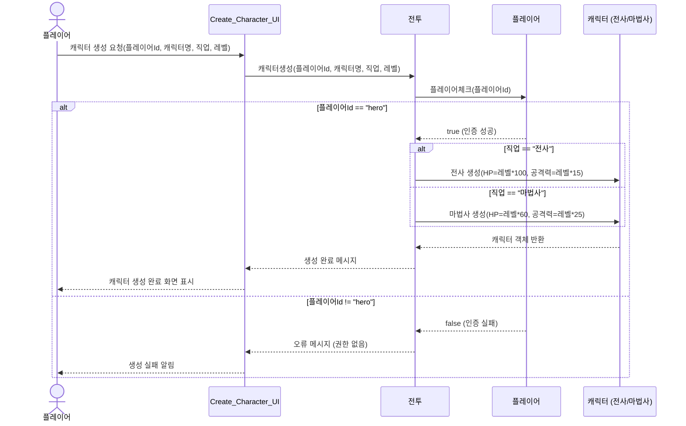

```mermaid
sequenceDiagram
    actor Player as 플레이어
    participant UI as Create_Character_UI
    participant Battle as 전투
    participant PlayerClass as 플레이어
    participant Char as 캐릭터 (전사/마법사)

    Player->>UI: 캐릭터 생성 요청(플레이어Id, 캐릭터명, 직업, 레벨)
    UI->>Battle: 캐릭터생성(플레이어Id, 캐릭터명, 직업, 레벨)
    
    Battle->>PlayerClass: 플레이어체크(플레이어Id)
    alt 플레이어Id == "hero"
        PlayerClass-->>Battle: true (인증 성공)
        
        alt 직업 == "전사"
            Battle->>Char: 전사 생성(HP=레벨*100, 공격력=레벨*15)
        else 직업 == "마법사"
            Battle->>Char: 마법사 생성(HP=레벨*60, 공격력=레벨*25)
        end
        Char-->>Battle: 캐릭터 객체 반환
        Battle-->>UI: 생성 완료 메시지
        UI-->>Player: 캐릭터 생성 완료 화면 표시
    else 플레이어Id != "hero"
        PlayerClass-->>Battle: false (인증 실패)
        Battle-->>UI: 오류 메시지 (권한 없음)
        UI-->>Player: 생성 실패 알림
    end
```