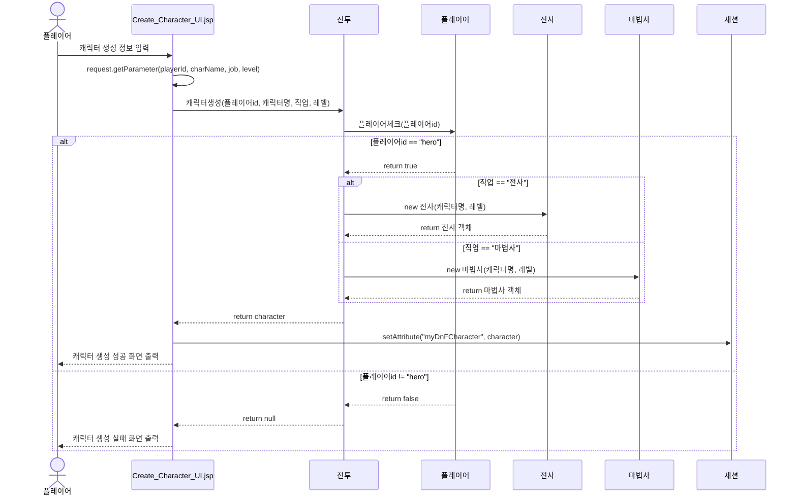

```mermaid
sequenceDiagram
    actor Player as 플레이어
    participant UI as Create_Character_UI.jsp
    participant Battle as 전투
    participant PlayerClass as 플레이어
    participant Warrior as 전사
    participant Mage as 마법사
    participant Session as 세션

    Player->>UI: 캐릭터 생성 정보 입력
    UI->>UI: request.getParameter(playerId, charName, job, level)

    UI->>Battle: 캐릭터생성(플레이어id, 캐릭터명, 직업, 레벨)
    Battle->>PlayerClass: 플레이어체크(플레이어id)

    alt 플레이어id == "hero"
        PlayerClass-->>Battle: return true

        alt 직업 == "전사"
            Battle->>Warrior: new 전사(캐릭터명, 레벨)
            Warrior-->>Battle: return 전사 객체
        else 직업 == "마법사"
            Battle->>Mage: new 마법사(캐릭터명, 레벨)
            Mage-->>Battle: return 마법사 객체
        end

        Battle-->>UI: return character
        UI->>Session: setAttribute("myDnFCharacter", character)
        UI-->>Player: 캐릭터 생성 성공 화면 출력

    else 플레이어id != "hero"
        PlayerClass-->>Battle: return false
        Battle-->>UI: return null
        UI-->>Player: 캐릭터 생성 실패 화면 출력
    end
```